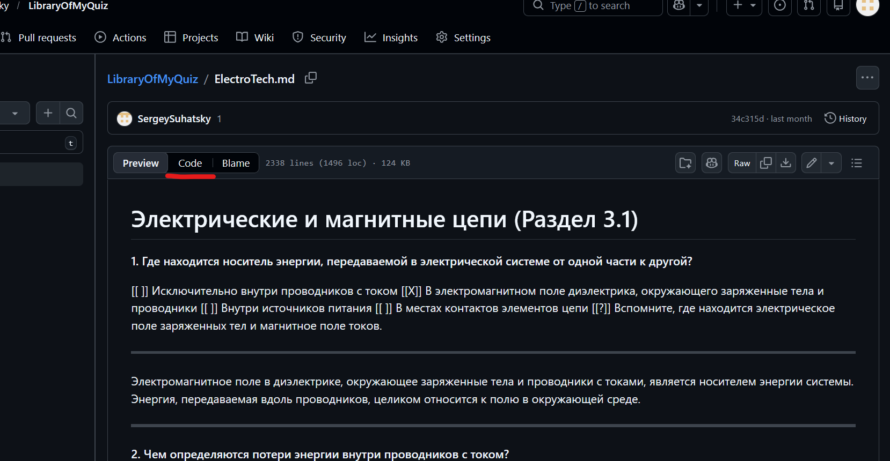
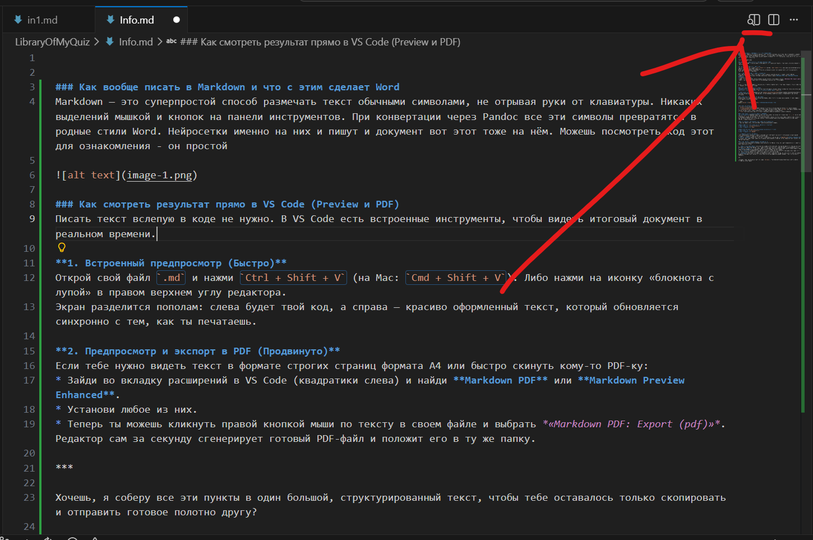
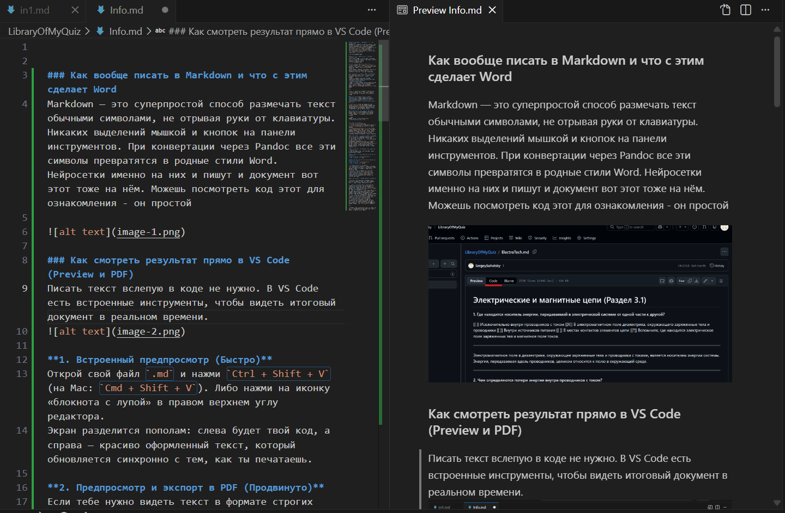
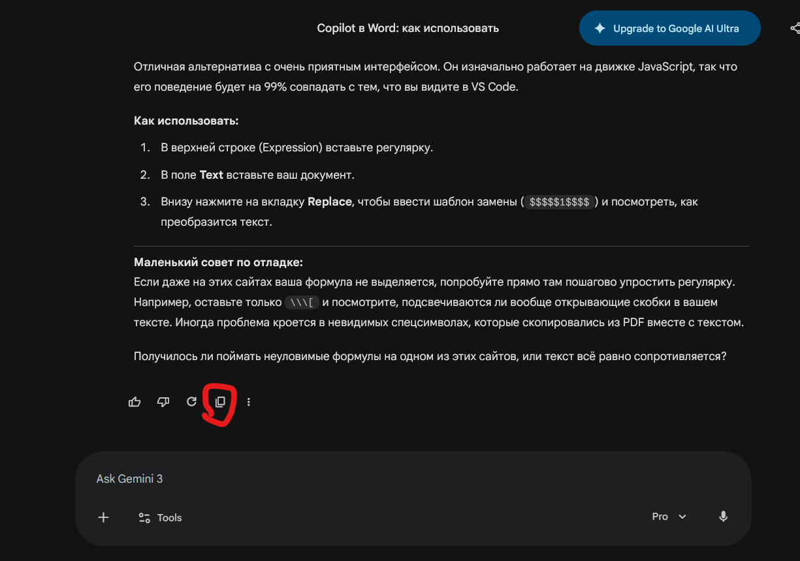
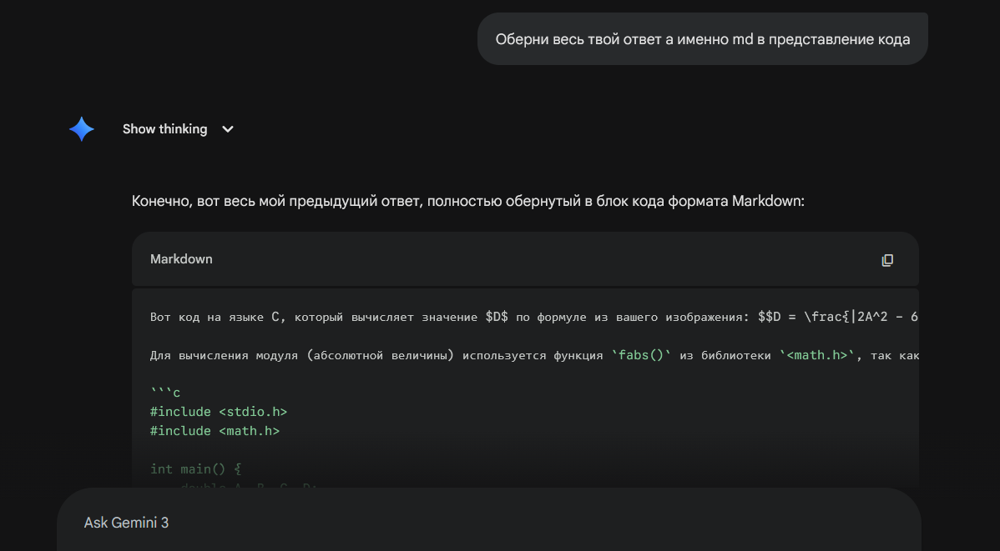
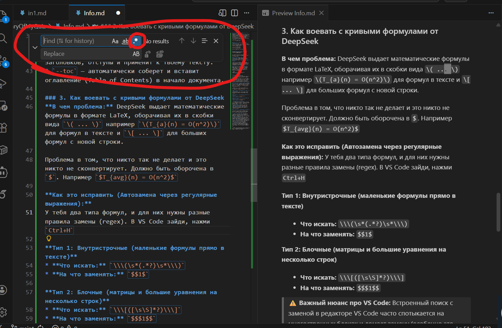
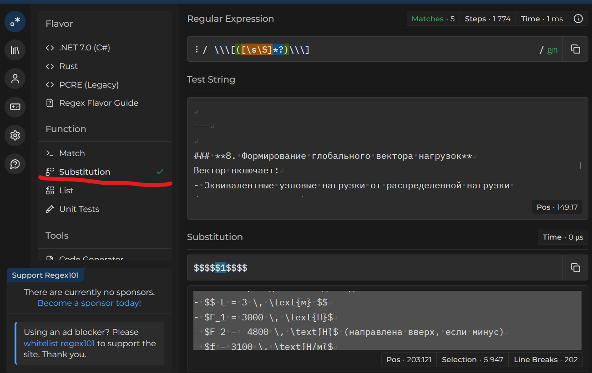
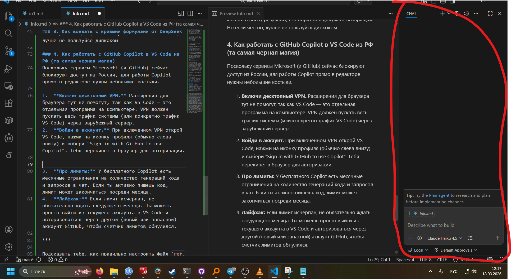
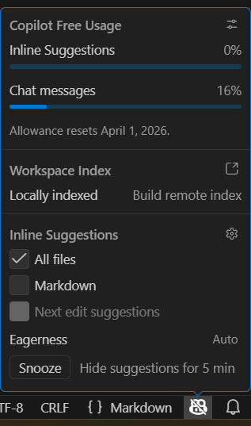

## Оглавление
- [Оглавление](#оглавление)
  - [Как вообще писать в Markdown и что с этим сделает Word](#как-вообще-писать-в-markdown-и-что-с-этим-сделает-word)
  - [Как смотреть результат прямо в VS Code (Preview и PDF)](#как-смотреть-результат-прямо-в-vs-code-preview-и-pdf)
  - [Как получить код нейронок в формате .md](#как-получить-код-нейронок-в-формате-md)
  - [1. Что такое Pandoc и зачем он нужен](#1-что-такое-pandoc-и-зачем-он-нужен)
  - [2. Как конвертировать файл из .md в Word](#2-как-конвертировать-файл-из-md-в-word)
  - [3. Как воевать с кривыми формулами от DeepSeek](#3-как-воевать-с-кривыми-формулами-от-deepseek)
  - [4. Как работать с GitHub Copilot в VS Code из РФ (та самая черная магия)](#4-как-работать-с-github-copilot-в-vs-code-из-рф-та-самая-черная-магия)

---

### Как вообще писать в Markdown и что с этим сделает Word
Markdown — это суперпростой способ размечать текст обычными символами, не отрывая руки от клавиатуры. Никаких выделений мышкой и кнопок на панели инструментов. При конвертации через Pandoc все эти символы превратятся в родные стили Word. Нейросетки именно на них и пишут и документ вот этот тоже на нём. Можешь посмотреть код этот для ознакомления - он простой  




### Как смотреть результат прямо в VS Code (Preview и PDF)
Писать текст вслепую в коде не нужно. В VS Code есть встроенные инструменты, чтобы видеть итоговый документ в реальном времени.


В итоге вот так выглядит.


Выводится пдфка, на ворде другое будет


### Как получить код нейронок в формате .md
На Gemini и DeepSeek нажимаешь эту кнопку:



На остальных не знаю дают ли .md текст, но
если нет, то можешь такой лайфхак сделать 

### 1. Что такое Pandoc и зачем он нужен
**Pandoc** — это эдакий швейцарский нож для текстовых файлов. В нашем случае он нужен для одной конкретной магии: **превратить твой Markdown-файл (`.md`) в красивый документ Word (`.docx`)**. 

* **Где скачать:** Идем на официальный сайт [pandoc.org/installing.html](https://pandoc.org/installing.html) и скачиваем установщик под свою операционную систему (Windows, macOS или Linux). Устанавливается как обычная программа.

### 2. Как конвертировать файл из .md в Word
Когда у тебя готов файл Markdown и установлен Pandoc, нужно открыть терминал (или командную строку) в папке с твоим файлом и ввести эту команду:

```bash
pandoc in1.md -o final_document.docx --reference-doc=ref.docx --toc
```

При этом тебе обязательно подтянуть файлик Ворд ref.docx из этого репозитория, в менюшке слева найдёшь, так же как и файл in1.md, где было то, что я кидал тебе из дипкока, можешь его тоже потыкать как под и как предпросмотр. Я ещё оставил `MdToWord.bat` - это буквально тот код выше, но который можно запускать как файлик и не вписывать постоянно комманду. Из минусов если поменяешь названия, то тебе нужно открыть `.bat` как текстовик и имя поменять

**Что здесь происходит:**
* `in1.md` — твой исходный файл.
* `-o final_document.docx` — так будет называться готовый вордовский файл на выходе (`-o` значит output).
* `--reference-doc=ref.docx` — это очень крутая штука. Ты подсовываешь файл `ref.docx` как шаблон дизайна. Pandoc возьмет из него шрифты, размеры заголовков, отступы и применит к твоему тексту.
* `--toc` — автоматически соберет и вставит оглавление (Table of Contents) в начало документа.

### 3. Как воевать с кривыми формулами от DeepSeek
**В чем проблема:** DeepSeek выдает математические формулы в формате LaTeX, оборачивая их в скобки вида `\( ... \)` например `\(T_{a}(n) = O(n^2)\)` для формул в тексте и `\[ ... \]` для больших формул с новой строки. 

Проблема в том, что никто так не делает и это никто не сконвертирует. Должно быть оборочена в   `$`. Например `$T_{avg}(n) = O(n^2)$`

**Как это исправить (Автозамена через регулярные выражения):**
У тебя два типа формул, и для них нужны разные правила замены (regex). В VS Code зайди, нажми `Ctrl+H`



А потом вводи формулы, что я кинул выше. Правда, для многострочных оно не работает, приходится на другой сайт заходить для этого, об этом ниже

**Тип 1: Внутристрочные (маленькие формулы прямо в тексте)**
* **Что искать:** `\\\(\s*(.*?)\s*\\\)`
* **На что заменять:** `$$1$`

**Тип 2: Блочные (матрицы и большие уравнения на несколько строк)**
* **Что искать:** `\\\[([\s\S]*?)\\\]`
* **На что заменять:** `$$$1$$`

> ⚠️ **Важный нюанс про VS Code:**
> Встроенный поиск с заменой в редакторе VS Code часто спотыкается на многострочных блоках и ломает замену (особенно это касается регулярки для блочных формул).
> **Лучшее решение:** Выдели весь свой текст, скопируй его и иди на сайт **[regex101.com](https://regex101.com/)**. Вставь текст туда, введи регулярное выражение, нажми замену и скопируй чистый, идеальный текст обратно. Это работает безотказно.



Слева выбираешь режим замены, сверху ставишь выражение что искать, в тест стринг твой текст от нейронки, ниже на что менять и внизу результат, его обратно в документ возвращай. Но если честно, лучше не пользуйся дипкоком

### 4. Как работать с GitHub Copilot в VS Code из РФ (та самая черная магия)
Поскольку сервисы Microsoft (и GitHub) сейчас блокируют доступ из России, для работы Copilot прямо в редакторе нужны небольшие костыли.

1.  **Включи десктопный VPN.** Расширения для браузера тут не помогут, так как VS Code — это отдельная программа на компьютере. VPN должен пускать весь трафик системы (или конкретно трафик VS Code) через зарубежный сервер.
2.  **Войди в аккаунт.** При включенном VPN открой VS Code, нажми на иконку профиля (обычно слева внизу) и выбери "Sign in with GitHub to use Copilot". Тебя перекинет в браузер для авторизации.

Тебе нужна эта менюха, она скорее всего по умолчанию включена, тебе заходить нужно.

3.  **Про лимиты:** У бесплатного Copilot есть месячные ограничения на количество генераций кода и запросов в чат. Если ты активно пишешь код, лимит может закончиться посреди месяца. (кнопка для лимита снизу справа)

1.  **Лайфхак:** Если лимит исчерпан, не обязательно ждать следующего месяца. Ты можешь просто выйти из текущего аккаунта в VS Code и авторизоваться через другой (новый или запасной) аккаунт GitHub, чтобы счетчик лимитов обнулился.
